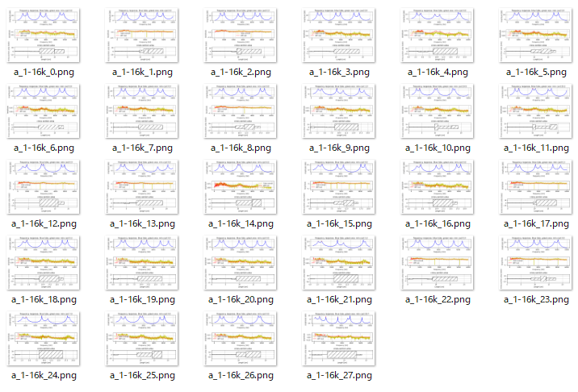

# Vocal Tube Estimation 3   

Load wav (16Khz mono), LPC analysis, get peaks candidates and pitch(F0) candidate.  
Exculde outliers using a cubic expression and interpolate about peaks and pitch(F0).  
Estimate four tube model length and area by grid search and scipy's optimize.fmin, downhill simplex algorithm.  
  
  
pks2tube5frame.py option:  
   --frame   use previous frame LA0 (estimated length and area) as initial value of scipy's optimize.fmin. Specify start frame number.  
   --BPF_out  compute BPF and show frequency response.  


## usage   
    
```
python pks2tube5frame.py -w wav/a_1-16k.wav -r result_figure_a -B
```
    
    

```
python pks2tube5frame.py -w wav/a_1-16k.wav -r result_figure_a -f 14 -B
```
    


## License    
MIT  

